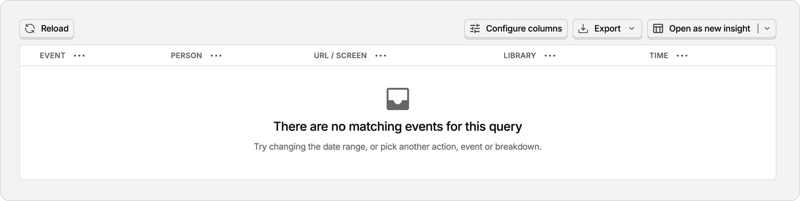
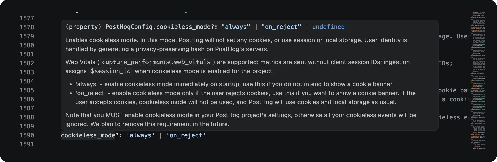
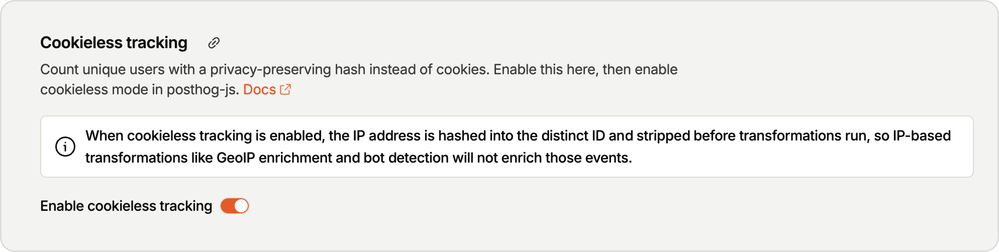

Know that feeling when you were preparing for something, stressed about it for days and when you did it you realized you forgot to check one last thing? Well, I do.

After few months of building, redesigning, hardening and even developing too much for the initial version I decided it's time. Time to publish a video to social media. Needed a drink or two to make it happen, but I finally did it. Published video to instagram, linkedin and tiktok.

The next day I wanted to check how many people actually tried the app, and since you dont need an account to _actually plan_ a wedding and unless you want to share it or synchronize it between devices naturally you don't need to log in, so naturally I didn't expect much logins, but at least few curious people to check out what I built. To my surprise - there was no activity in PostHog at all..

I was devastated. I was so stressed about posting a video like my life depended on it and yet I have no info about how it went at all!
Fix was actually super simple and _actually_ well documented, if you'd use proper types, you could just read it from JSDoc:

Why I didn't find it sooner? I was focused on developing application further to target wedding venues, and so I wasn't clicking around on the remote. Issue is that PostHog requires you to enable [Cookieless tracking](https://eu.posthog.com/project/169235/settings/project-web-analytics#cookieless-server-hash-mode) manualy on top of setting `cookieless_mode: always` in sdk.

Does it matter? Not much - I don't get money from this and I _will_ post more reels/tiktos/videos about `easywed.` going forward, so insights will appear with time. I just have no idea how many people actually tried the app.

Lesson learned - check your analytics before releases, because afterwards you may not know anything about how it went.

regardless - my app is now deployed, so [try easwed.app](https://easywed.app)
