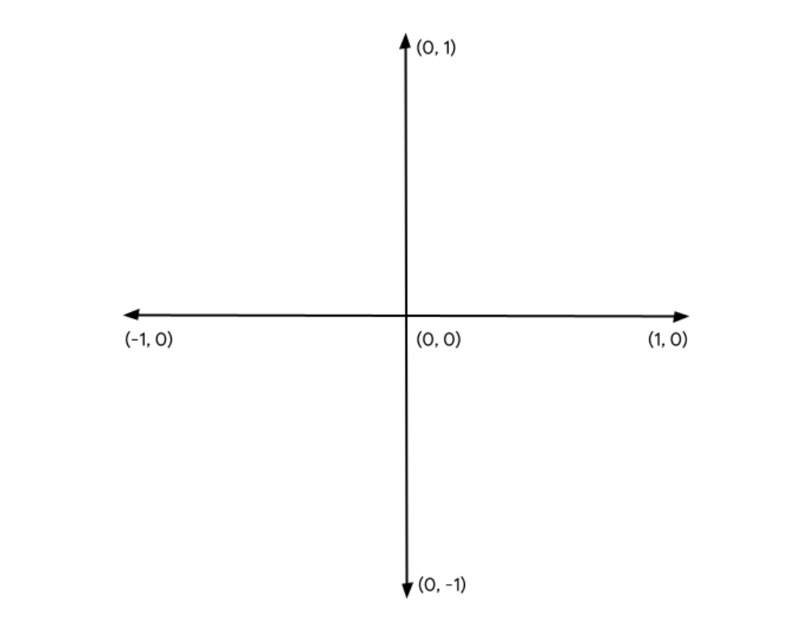

# webgpu

## docs
https://gpuweb.github.io/gpuweb/

## changelog format

i saw that my documenting progress is not going super well, so I decided to keep the changelog of what I was doing with potentially some notes on topics i learn

### 25.01
- use `renderLoop` to show data updating over time, can use manual approach (like currently done in index.html) or `requestAnimationLoop`
- updating state in place corrupts the results being drawn, it's best to use pingpong pattern and keep two versions of state between renders
  meaning the next step of simulation will only use result of the last step
- when writeBuffer is called - buffer was already sent to gpu - no need to preserve TypedArray state
- different layers require different bindings, that then need to be reference from `createBindGroup`
- GPU only exposes few data types that it can effectively work with, hence there's a need to use uint32[] instead of i.e. byte array to save memory
- storage buffer does not require specified size, can be very large, it's good to use them as general "storage"
- storage buffer are general use buffers that can be read and write from compute shaders and read from vertex shaders
- managing the state with storage buffer

### 24.01
- passing data between vertex shader to fragment shader requires specifying `location()` to point to the data that needs to be passed
- use structs to share input/output types between shaders

### 23.01
- [blog post on webGPU](https://surma.dev/things/webgpu/)
- in the shader instead of `pos` arguments, there is also access to [built-in values](https://gpuweb.github.io/gpuweb/wgsl/#built-in-values) calculated by WebGPU
```js
/**
 * this allows to use instancing, calling it like this will
 * render defined shader number of times specifed as second argument
 * additional logic needs to be handled in the shader
 */
pass.draw(number_of_vertices, howManyTimesToDraw)
```
- `pass.setBindGroup(0, bindGroup); // first parameter corresponds to @group in shader` needs to be called before drawing
- GPUBindGroup is an immutable handle - you cannot change resources it is pointing to after it was created, but contents of those resources can be changed
- *bind group* is a collection of resources for shader to access at the same time
- declaring uniform in the shader is not enough, `createBindGroup` is required for this purpose like
```js
/**
 * @returns {GPUBindGroup}
 */
const bindGroup = device.createBindGroup({
  label: "Cell renderer bind group",
  layout: cellPipeline.getBindGroupLayout(0), // corresponds to @group() in shader
  entries: [{
    binding: 0, // corresponds to @binding() in shader
    resource: { buffer: uniformBuffer }
  }],
});
```

### 22.01
- shader module can't be used on it's own, it's needed to use the most complex object in the entire api instead `GPURenderPipeline`
  it controls how geometry is drawn, which shaders are used, how to interpret vertex buffer data, etc
- fragment shaders are also defined as functions that instead of a position return vec4f of color (denoted with @fragment)
- vertex shaders are defined as functions that runs for each vertex defined in vertexBuffer (denoted with @vertex)
- shaders are created like
```js
/**
 * @returns {GPUShaderModule}
*/
const cellShaderModule = device.createShaderModule({
  label: "Cell shader",
  code: `
    // Your shader code (WGSL-wee gee sel) will go here
  `
});
```
<!-- DRAWING GEOMETRY SECTION -->
- `GPUBuffer` manages GPU-side memory
- to draw more complex geometry it's possible to use Index Buffer (not part of the tutorial).
- to calculate color to pixels drawn on the texture, one would use a *fragment shader*
- to transform the vertices into a clip space (or do any math calculations to do that) it is needed to use *vertex shaders*
- triangles are most commonly used to draw shapes, corner points that defines them are called *vertices*
- *Clip Space* is somewhat limited cartesian coordinate system, where X, Y and Z can only be represented by values between <-1, 1>;



### 21.01

- started going over [game of life tutorial](https://codelabs.developers.google.com/your-first-webgpu-app)

notes:
- all drawing operations are done within a *render pass*. each render pass begins with `beginRenderPass()` call -> define which textures should receive drawing commands.
- canvas context provides textures for code to draw into, and used format can impact how efficiently images are shown on the canvas
- not using preferred device's format may result in extra memory copies before the image can be displayed as part of the page (use `getPreferredCanvasFormat` to avoid that)
- canvas needs to be associated with the device like
```js
const adapter = await navigator.gpu.requestAdapter();
const device = await adapter.requestDevice();

const context = canvas.getContext("webgpu");
const canvasFormat = navigator.gpu.getPreferredCanvasFormat();

context.configure({
  device: device,
  format: canvasFormat,
});
```
